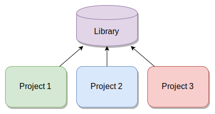
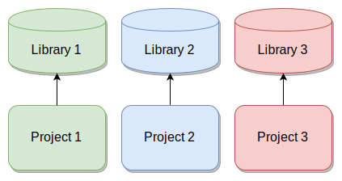
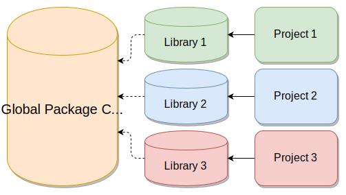

# The Motivation

--

Have you ever finished a project, come back a year later, and asked:

--

- _Why is my `dplyr` pipeline suddenly throwing an error? I swear it worked before..._

--

- _What happened to my `ggplot2` plots? Why are the bars upside down? I swear it worked before..._

--

- _Okay, I re-ran the analysis, but now `nlme` is complaining about model convergence: I swear this didn't happen before..._

--

How can we make sure this never happens, ever again?

---

# What is Packrat?

Before we talk about `renv`, let's talk about Packrat, our first effort to solve this problem.

--

> _The story so far: In the beginning Packrat was created. This has made a lot of people very angry and been widely regarded as a bad move._
>
> -- Douglas Adams, "The Hitchhiker's Guide to Reproducibility"

--

Packrat's main problem is that it is not a [pit of success](https://blog.codinghorror.com/falling-into-the-pit-of-success/).

--

It works, but for the average user, it's frustrating to use, and it's challenging to recover when errors arise.

--

### <center>renv's goal is to be a _better Packrat_.</center>

---

# What is ~~Packrat~~ renv?

--

`renv` is a toolkit used to manage _project-local libraries of **R** packages_.

--

You can use `renv` to make your projects more:

--

- **Isolated**: Each project gets its own _library_ of **R** packages, so you can feel free to upgrade and change package versions in one project without worrying about breaking your other projects.

--

- **Portable**: Because `renv` captures the state of your **R** packages within a _lockfile_, you can more easily share and collaborate on projects with others, and ensure that everyone is working from a common base.

--

- **Reproducible**: Use `renv::snapshot()` to save the state of your **R** _library_ to the _lockfile_ `renv.lock`. You can later use `renv::restore()` to restore your **R** library exactly as specified in the lockfile.

--

`renv` attempts to prescribe a default workflow that "just works" for most, but remains flexible enough that alternate workflows can be built on top of the tools provided by `renv`.

---

# The Lay of the Land

Before we discuss `renv` specifically, let's briefly outline the default state of the world, in terms of **R** package installations.

--

You've started a new project, and you're ready to analyze some data. You've downloaded `dplyr`, and you're ready to load and use it in your project:

--

```r
library(dplyr)
```

--

When this code is run, **R** searches the _active library paths_ for an installed copy of the `dplyr` package, then loads it. The natural questions that arise are:

--

1. What is a *library path*?

--

2. What are the _active_ library paths?

--

3. How does **R** search these library paths when loading a package?

--

Let's explore each of these concepts quickly.

---

# What is a Library Path?

We can borrow the definition from
the [R extensions](https://cran.r-project.org/doc/manuals/r-release/R-exts.html#Creating-R-packages) manual:

--

> A directory into which packages are installed.

--

That's it -- it's just a directory. Nothing more, nothing less.

--

Let any remaining mystique be dispelled.

---

# What is a Library Path?

Each **R** session can be configured to use multiple library paths -- that is, the default set of directories that **R** will search when attempting to find and load a package.

--

The `.libPaths()` function is used to get and set the library paths for an **R** session. For example, on my macOS machine running with **R** 3.6:

--

```{r eval=FALSE}
> .libPaths()
[1] "/Users/kevinushey/Library/R/3.6/library"
[2] "/Library/Frameworks/R.framework/Versions/3.6/Resources/library"
```

--

In this case, I have my own **user** library, which is first in the list. This is where packages I choose to download and install normally get installed.

--

The last library in the list is the **system** library. This is where the default packages that come with **R** are installed.

--

You may also have one or more **site** libraries -- think of these as administrator-managed directories of packages.

---

# What is a Library Path?

**R** searches the active library paths, _in order_, to find an installation of the requested package.

--

The _first_ installation of the package that is discovered is loaded. The package's dependencies are also loaded from these same library paths.

--

So, back to our example with:

--

```{r eval=FALSE}
library(dplyr)
```

--

When this code is run, **R** will search the *active library paths* for an installation of the `dplyr` package, and load the first one it finds. 

--

You can use `find.package()` to search the library paths for an installed package:

--

```{r eval=FALSE}
> find.package("dplyr")
[1] "/Users/kevinushey/Library/R/3.6/library/dplyr"
```

---

# The Challenge

By default, each **R** session uses the _same_ set of library paths.

--



--

This implies that if you were to install `dplyr 0.8.2`, that package would then become available in all three projects.

---

# The Challenge

However, _different_ projects may have _different_ package dependencies. For example, suppose:

--

- **Project 1** requires `dplyr 0.7.8`,

--

- **Project 2** requires `dplyr 0.8.2`, and

--

- **Project 3** requires the development version of `dplyr`.

--

Unfortunately, these projects _share the same library paths_!

--

Hence, installing a new version of `dplyr` implies changing the version of `dplyr` used by each project.

--

This could spell disaster -- _especially_ if you had no record of which version of `dplyr` (or its dependencies!) were used for a particular project.

---

# The Solution

The solution, then, is to use _project-local libraries_, to ensure that each project gets its own unique library of **R** packages.

--



--

By using _project-local libraries_, you can rest assured that upgrading the packages used in one project will not risk breaking your other projects.

---

# The Solution

It is from this idea -- the use of _project-local libraries_ -- that the `renv` package is borne. We:

--

- Give each project its own _project-local library_,

--

- Make it simple and straightforward for **R** sessions to use the _project-local library_,

--

- Provide tools for managing the **R** packages installed in these _project-local libraries_,

--

And make the experience as seamless as possible, so that one can use `renv` without being an expert on `renv`.

---

# Initializing a Project

The first step in activating `renv` for a project is:

--

```r
renv::init()
```

--

This function _**forks**_ the state of your default **R** libraries into a project-local library, and then prepares the infrastructure required to use `renv` in that project.

--

In particular, a project-local `.Rprofile` is created (or amended), which is then used by new **R** sessions to automatically initialize `renv` and ensure the project-local library is used.

--

After calling `renv::init()`, you can continue working exactly as you did before. The only difference is that packages will now be installed to, and loaded from, your project-local library.

---

# Initializing a Project

There are two main observable differences you'll see in your **R** session after `renv` has been activated in a project.

--

Firstly, a small banner will be displayed in the console:

```{r eval=FALSE}
* Project '~/projects/2020-rstudio-conf' loaded. [renv 0.9.2]
>
```

--

Secondly, the library paths (as reported by `.libPaths()`) will now be changed.

```{r eval=FALSE}
> .libPaths()
[1] "/Users/kevinushey/projects/2020-rstudio-conf/renv/library/R-3.6/x86_64-apple-darwin15.6.0"
[2] "/private/var/folders/b4/2422hswx71z8mgwtv4rhxchr0000gn/T/RtmpmchotD/renv-system-library" 
```

You'll notice the use of a project-local library path, as well as a separate system library path (used for sandboxing, which we'll discuss later).

---

# Saving and Loading

We've discussed `renv`'s first goal -- make it simple to use project-local libraries.

--

The second goal is to make it possible to _save_ and _load_ the state of your project-local libraries.

--

Or, in the parlance of `renv`, you can _snapshot_ and _restore_ the state of your project-local libraries.

--

```{r eval=FALSE}
renv::snapshot()  # save the project's library state
renv::restore()   # load the project's library state
```

--

Let's discuss how these functions work.

---

# Snapshot

You can capture the state of a project library using:

--

```r
> renv::snapshot()
The following package(s) will be updated in the lockfile:

# CRAN ===============================
- markdown    [* -> 1.1]
- rmarkdown   [* -> 2.1]
- yaml        [* -> 2.2.0]

Do you want to proceed? [y/N]: y
* Lockfile written to '~/projects/2020-rstudio-conf/renv.lock'.
```

--

The state of your project library will be encoded into a _lockfile_, called `renv.lock`.

--

The _lockfile_ is a text (JSON) file, enumerating the packages installed in your project, their versions, and their _sources_.

---

# Lockfile Example

```json
{
  "R": {
    "Version": "3.6.1",
    "Repositories": [
      {
        "Name": "CRAN",
        "URL": "https://cran.rstudio.com"
      }
    ]
  },
  "Packages": {
    "renv": {
      "Package": "renv",
      "Version": "0.9.2",
      "Source": "Repository",
      "Repository": "CRAN"
    },
    < ... other package records ... >
  }
}
```

---

# Lockfiles

The lockfile encodes the information required to later recover and re-install packages as necessary. This is useful for:

--

- Time capsules, where you might want to freeze a project such that you can later return to the project with a record of the packages originally used to run the project,

--

- Collaborative workflows, where you might want to ensure all collaborators are working with the exact same set of packages, and

--

- Deployments, where you'd like to be sure that your project, when run remotely, uses the exact same set of packages that you were testing with locally.

--

We'll see how you can use `renv.lock` to restore a project library next.

---

# Restore

Given a lockfile `renv.lock` previously created by `renv::snapshot()`, you can restore the state of your project library using `renv::restore()`:

--

```r
> renv::restore()
The following package(s) will be updated:

# CRAN ===============================
- markdown    [* -> 1.1]
- rmarkdown   [* -> 2.1]
- yaml        [* -> 2.2.0]

Do you want to proceed? [y/N]: y
Installing markdown [1.1] ...
	OK (linked cache)
Installing yaml [2.2.0] ...
	OK (linked cache)
Installing rmarkdown [2.1] ...
	OK (linked cache)
```

--

Calling `renv::restore()` will download and re-install all of the declared packages as necessary.

---

# Restore

`renv` contains the machinery required to install packages from many sources, including:

--

- CRAN

--

- Bioconductor

--

- GitHub

--

- Gitlab

--

- Bitbucket

--

`renv` also understands how to authenticate with private repositories as well. See https://rstudio.github.io/renv/articles/renv.html#authentication for more details.

---

# Summary

We've now covered the three primary features of `renv`:

--

1. Use `renv::init()` to initialize a project with a project-local library,

--

2. Use `renv::snapshot()` to save the project-local library's state,

--

3. Use `renv::restore()` to restore the project-local library's state,

--

The rest of this talk will focus on some of the extra features provided by `renv`.

---

# Global Package Cache

One major issue with project-local libraries is the duplication of identical packages across projects.

--

For example, if you had 10 projects using `dplyr 0.9.2`, then you would also have 10 project libraries with `dplyr 0.9.2` installed.

--

This is costly -- both in terms of disk space used, as well as in installation time.

--

Imagine having to re-install all packages from the `tidyverse` every time you started a new project.

--

```r
> system.time(install.packages("tidyverse"))
Installing package into '/home/kevin/R/x86_64-pc-linux-gnu-library/3.6'
(as 'lib' is unspecified)
also installing the dependencies <... 82 other packages ...>
< ... >
   user  system elapsed 
780.492 157.073 375.784 
```

--

<center>🤮</center>
 
---

# Global Package Cache

`renv` solves this problem through the use of a _global package cache_.

--



--

When `dplyr 0.9.2` is installed, `renv` will **move** that installation into the global cache, and then **link** that installation into the project library as requested.

---

# Package Installation

`renv` contains a helper function, `renv::install()`, that can be used to install packages.

--

It borrows from the model used by the [`remotes`](https://remotes.r-lib.org) package for installing packages.

--

For example:

--

```{r eval=FALSE}
renv::install("r-lib/rlang")
```

--

can be used to install the development version of [`rlang`](https://rlang.r-lib.org/) package from GitHub.

---

# Package Installation

The primary bonus is that `renv` will use the global package cache as appropriate when attempting to install a package -- thereby avoiding an unnecessary attempt to download and re-install an already-cached version of a package.

--

```r
system.time(renv::install("tidyverse"))

< ... >

Installing rvest [0.3.5] ...
	OK (linked cache)
Installing tidyverse [1.3.0] ...
	OK (linked cache)

   user  system elapsed 
  0.802   0.141   1.054 
```

--

<center>☺️</center>

---

# Dependency Discovery

`renv` also includes some machinery which can be used to find which **R** packages are used in your project.

--

```{r eval=FALSE}
renv::dependencies()
```

--

This function will crawl the **R** scripts in your project to determine what **R** packages are referenced in your code. `.R`, `.Rnw`, and `.Rmd` files are all supported.

--

For example, the project hosting these slides uses the following packages:

--

```{r eval=FALSE}
> renv::dependencies()
Finding R package dependencies ... Done!
      Source   Package Require Version   Dev
1  renv.lock      renv                 FALSE
2 slides.Rmd rmarkdown                 FALSE
3 slides.Rmd  xaringan                 FALSE
```

---

# Snapshot Types

Sometimes, it can be important to control which packages enter the `renv.lock` lockfile. By default, _only packages used in the project_, as reported by `renv::dependencies()`, will enter the lockfile.

--

In other words, if you have a package installed in your project library, but you don't actually reference or use that package in your project, it will not enter the lockfile!

--

This can be useful if you have auxiliary packages that you use during project development, but don't actually require those packages at runtime.

--

The snapshot type can be configured on a per-project basis, with:

```{r eval=FALSE}
renv::settings$snapshot.type("packrat")  # used packages
renv::settings$snapshot.type("simple")   # all packages
```

---

# Version Control

--

By default, every project contains only a single `renv.lock`. A natural question, then, is:

--

> _How do I manage the history of my `renv.lock`?_

--

`renv` delegates this responsibility to your version control system, and provides some special helpers for working specifically with [Git](https://git-scm.com/).

--

```r
# find prior commits in which renv.lock has changed
renv::history()

# revert renv.lock to its state at a prior commit
renv::revert(commit = "abc123")
```

--

See also: [Happy Git and GitHub for the useR](https://happygitwithr.com/)

---

# Configuring renv

While `renv` tries to provide a default workflow that works well in most cases, you may still find it doesn't quite fit your particular use case.

--

Fortunately, `renv` is fairly extensible and configurable:

--

- See `?renv::paths` for configuration of the various paths used by `renv` (e.g. library, cache paths),

--

- See `?renv::config` for configuration of user-level behaviors,

--

- See `?renv::settings` for configuration of project-level settings.

--

For example, you can disable the use of the `renv` cache in a particular project, with:

```{r eval=FALSE}
renv::settings$use.cache(FALSE)
```

---

# What's Missing?

--

`renv`, on its own, is _not_ a panacea. It solves only one part of the problem -- reproduction of a project's **R** package dependencies. There are a myriad of other factors that can affect the results of an analysis, including (but not limited to):

--

- The version of **R**,

--

- The operating system in use,

--

- The compiler flags / versions used when **R** and packages are built,

--

- The LAPACK / BLAS system(s) in use,

--


And so on. [Docker](https://www.docker.com/) is a tool that helps solve this
problem through the use of __containers__. Very roughly speaking, one can think
of a container as a small, self-contained system within which different
applications can be run. For more details, please see <https://environments.rstudio.com/docker>.

---

# What's Missing?

You can view `renv` and Docker as complementary tools. Use Docker to manage your system-level requirements, and use `renv` to manage your **R** package-level requirements.

--

In addition, the [rocker](https://www.rocker-project.org/) project brings **R** to Docker, and provides pre-built Docker images using **R** built on top of the [Debian](https://www.debian.org/) Linux operating system.

--

See https://rstudio.github.io/renv/articles/docker.html for more details.

---

class: center, bottom, inverse

## https://github.com/kevinushey/2020-rstudio-conf

<br/>

# Thanks for attending!

Install `renv` from CRAN with:

`install.packages("renv")`

View the `renv` [pkgdown](https://pkgdown.r-lib.org/) documentation online at:

https://rstudio.github.io/renv/

Learn more about RStudio's tools for environment management:

https://environments.rstudio.com/

